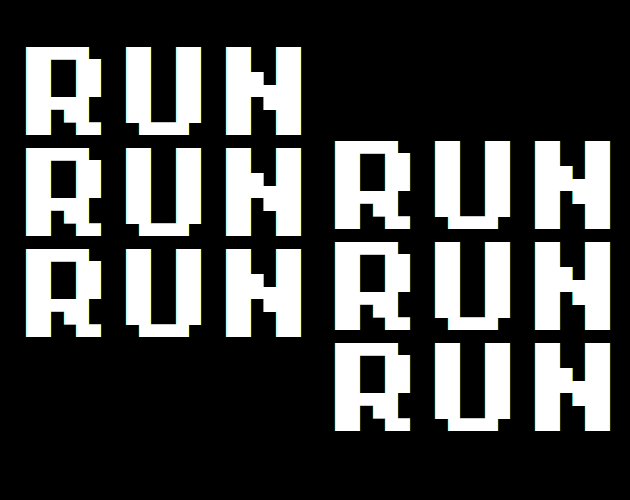

I was not expecting that anything would go wrong. But stuff like printers and
This January I decided to enter [My First Game Jam: Winter 2021](https://itch.io/jam/my-first-game-jam-winter-2021) because I wanted to learn what making a game was. So with some spare time and a decided mind I entered with a game called [RUN, RUN, RUN](https://snat-s.itch.io/run-run-run). It was a troubled development and I will explain why down below after explaining what is a game jam.

# What is a Game Jam?

> A game jam is an event where participants try to make a video game as quickly as possible.
> 
> -   Christer Kaitila

And with that out of the way I would like to mention that this game jam took place during a fourteen day period. With a community that is really amazing and actually cares about what you are creating.

# The Experience.

## Preparing the game jam

I thought about preparing for the game jam because I didn&rsquo;t want to go cold. But respecting the best practices of the name of the jam I decided to just select the game engine I would use and the general art style I would follow.

-   For the game engine I decided to use the Godot Engine because I heard about it from Mizizizi&rsquo;s channel. The reason for the decision was basically that I wanted an open source engine that would run properly on linux and it was not that hard to get into.
-   For the art style I ended up discovering the incredible art by Kenny and decided to use something simple from him. Specifically the asset pack that I chose was the 1bitplatformer because I wanted to do something with platforms.

## The learning process

At the begining I thought that I would crush the jam because it was a beginners competition. But the more I looked into creating this pice of entertainment I realized that it was a bit more difficult that what I was expecting.

### GDQuest my savior

After searching for a little bit. I realized that I wanted a more *beginner friendly* tutorial, and what I found was the excellent free series of videos made by [GDQuest](https://www.youtube.com/watch?v=6ziIyx60N6I).
This, is a really great five hour introductory course to Godot and all of it&rsquo;s tiny details that you have to get acustom.
After watching the first two parts of the series and kindoff following along with other tutorials to complement stuff like tiling and animations. I realized I was proud of what I created.

## The problems begin

### Polish in Poland

I know it sounds kind of stupid but I really think that you should do a lot. Because in a game jam if you do a short game, it will not matter so its really better for your sanity and general **buginesse** of the game to just have one or two mechanics and try to polish them a lot.
I think everyone has heard of the story of Icarus, and for real, anytime that you try to scale a gamejam things start to fall apart. You just fly to close to the sun.

### Make things pretty

This is completly related with the past point. Try to polish everything in terms of mechanics, but if you can actually just make it look really good. Most of the time people can look past the errors of the game. If you don&rsquo;t have general art skills just use an asset pack.

### Always do version control

I recently have started using github. But I have never been acustom to using something like a version control system.

<b>And this is where everything goes wrong.</b>

I made a kindoff *beta* of the game and send it to some of my friends and made them play test it.
I was not expecting that anything would go wrong. But my fate was different and my computer started corrupting files for no aparent reason (*I guess I could have fixed it but there was not a lot of time left and I wanted to have a functional computer to have my uni classes*). By the time this happened I created a backup of my entire computer and just flashed my entire computer and installed **Fedora** because the *Arch lifestyle* was too cool for me.
And finally, the game could not be open in my new install of Fedora. And with two days to fix the problem. I decided to just give up. I was not confortable with trying to fix another problem of this bug.

<i>This things are fun they said.</i>

I thought, and with that in my mind. I created a website in itch.io that you can find [here](https://snat-s.itch.io/run-run-run) and decided to just leave it at that.

## Conclusion

Try to plan your projects with at least a bit more time and think about what you want to do. Always use version control software, it is not difficult once you know what you are doing. And finally have *fun* game jams are about fun. If you are not enjoying the process and the stress I would recommend you to do another thing in your free time.

